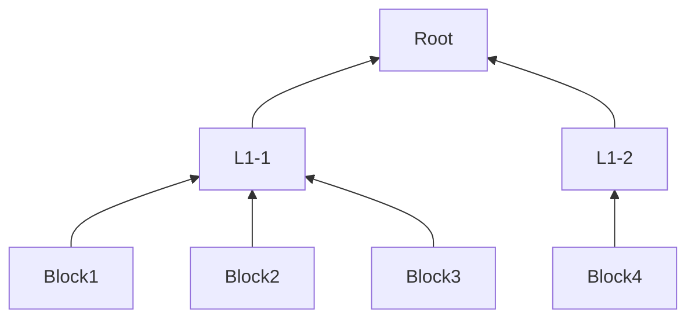

### 文件块列表下载文件提案

#### 背景

目前下载的流程是通过解析文件的FileHash，获得根节点的下一层L1的所有节点，通过解析L1层所有节点的第一个节点来解析第二层L2节点，不断按宽度搜索的方式来获取到整个文件所有的文件块数据。大概就是按下图的结构：

只有下载了第一个Root文件块，才能获得L1-1 和L1-2 这两个文件块，之后才能获取到Block1~4的文件块。

#### 问题

上面的流程在导致的问题有：

1. 数据是顺序下载的，前面的数据下载不了，后面的数据无法继续下载。
2. 假设前面数据在尝试多个节点之后下载成功了，后面的数据才能开始下载，这个尝试过程其他的节点是处于空闲状态。

#### 新实现方案

1. 借鉴tx的验证思路，可以做 `merkle tree root`计算得出一个 hash，暂命名为`BlocksRoot` 这个可认作文件的特征值，存在合约里。（后续max重构如果有相应的验证方案可以替代这个方案）
2. 文件在开始下载的时候有握手协议，这个时候可以告知文件的所有BlockHash，按1GB文件有4000个块Hash来算，大概180KB的数据量。通过查合约比较block hash列表计算出来的`BlocksRoot` 是否相等
3. 将所有的文件块的下载请求分组，新建成为下载任务，放到任务池里。所有节点并发去下载。对于一个任务设置最大的超时时间，失败则换新节点去下载。
4. 获取到所有的BlockHash之后，也支持上层做顺序下载和乱序下载两种下载模式。

#### 改动的代码

**合约修改**

Fs合约的FileInfo字段增加BlocksRoot

FileInfo增加该字段，有两个优势: 第一、在上传文件的流程，存储节点可以用这个值验证接收到的数据，而不需要再去解析 根节点。 第二、下载文件的流程，如果使用FileHash下载，可以直接从合约查询到BlocksRoot

**URL注册信息修改**

URL合约的 域名描述值 在注册的时候增加BlocksRoot

下载文件的流程，如果使用URL下载，可以直接从合约查询到BlocksRoot

**下载的握手协议，下载的任务池代码更新。**

握手交互流程，需要告知BlockHashes的。 任务池根据文件块建立下载的请求任务。

**增加验证BlockHashes相关代码**

