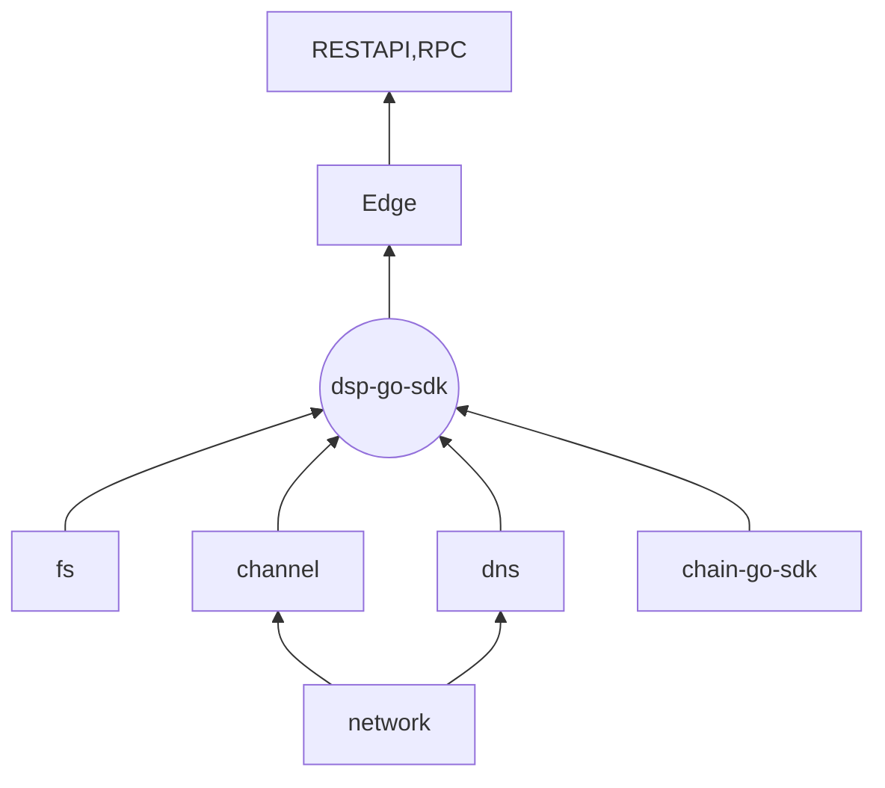

### 开发者使用手册（测试网）


#### 一、如何使用

我们为开发者实现了一整套底层存储的基础设施，具有状态通道，文件存储，主链交互等基础服务。目前提供的工具有：

* DSP-go-sdk
* Edge客户端实现
* Edge REST API 文档


#### 二、基本组成架构




#### 三、启动Edge并接入测试网

1. 配置`config.json`文件

   ```json
   {
     "base": {
       "BaseDir": ".",  // 工作目录
       "NetworkId": 0,	 // 网络ID， 保留字段
       "PortBase": 10000,	// 端口起点
       "LogLevel": 1,			// 日志等级
       "LogPath": "./Log",	// 日志文件目录
       "JsonRpcPortOffset": 138,	// 本地RPC端口offset, 实际端口为 base+offset  即 10138
       "EnableJsonRpc": false,			// 是否开启本地RPC服务
       "HttpRestPortOffset": 135,	// 本地Rest端口offset
       "HttpCertPath": "",					// https证书路径	
       "HttpKeyPath": "",					// https 私钥路径
       "RestEnable": true,					// 是否开启本地Rest服务
       "ChannelProtocol": "kcp",		// channel网络协议
       "ChannelPortOffset": 3001,	// channel端口offset
       "ChannelClientType": "rpc",	// channel调用全节点接口方式
       "ChannelRevealTimeout": "200",	// channel reveal timeout
       "DBPath": "./DB",					// 业务逻辑层数据库目录
       "PpListenAddr": "",				// 保留字段	
       "PpBootstrap": {},				// 保留字段
       "ChainRestAddr": "http://221.179.156.57:10334",  // 主链restful api地址
       "ChainRpcAddr": "http://221.179.156.57:10336",		// 主链rpc api 地址
       "NATProxyServerAddr": "kcp://40.73.100.114:6009",
       "DspProtocol": "kcp",			// dsp网络协议
       "DspPortOffset": 4001,		// dsp 端口offset
       "TrackerPortOffset": 0,		// 保留字段
       "DnsNodeMaxNum": 100,			// DNS节点最大数目
       "AutoSetupDNSEnable": true,	// 是否允许自动连接DNS节点并创建通道
       "SeedInterval": 10,		// 自身做种时间间隔
       "DnsChannelDeposit": 1000000000,		// 自动连接DNS节点时，自动充值的通道金额
       "WalletPwd": "pwd",				// 钱包密码
       "WalletDir": "./wallet.dat"	// 钱包文件
     },
     "fs": {
       "FsRepoRoot": "./FS", // fs目录路径
       "FsFileRoot": "./Downloads",  // 下载的文件路径
       "FsType": 0		// 0: 客户端， 1: 存储端
     },
     "Bootstraps": [] // 保留字段
   }
   ```

   

2. 通过命令行方式启动，执行以下命令

   注意: `—config` 后面的值为`config.json`文件所在目录路径

   ```shell
   $ ./edge --config=.
   ```

   

3. 首次启动等待状态通道同步区块数据, 可以使用以下命令查看同步进度

   ```shell
   $ ./edge channel initprogress
   ```

   返回的结果为:

   ```json
   {
      "Progress": 0.030025735, // 当前同步进度， 1为同步完成
      "Start": 108631, // 开始同步的区块高度
      "End": 112128,	 // 结束同步的区块高度
      "Now": 108736	// 当前同步的区块高度
   }
   ```

4. 创建钱包

   另起一个`terminal`窗口，执行以下命令

   ```shell
   $ ./edge account create
   ```

5. 向测试网申请资产

6. `Edge`根据以下配置项会判断是否与`DNS`节点创建通道

   ```json
   {
     AutoSetupDNSEnable: true
   	DnsChannelDeposit: 1000000000
   }
   ```

7. 开始使用存储服务


#### 四、REST API文档

文档使用第三方Apizza协作工具，可以点击[这里](https://apizza.net/pro/#/project/3d9c9224cc6edbe7a269863f09b8e656/browse)查看


#### 五、使用RPC命令

1. 购买空间

   ```shell
   $./edge userspace set --walletAddr=AV56T835S5afZEoqwLZcjXcMRw8YYDkZtq --second=3600 --secondOp=1 --size=10240 --sizeOp=1
   ```

   返回结果

   ```shell
   {
      "Tx": "75cdd4b9e30e16e91970fb2243a79807c65d401646732591ffd7c000b83cf3be"
   }
   ```

   

2. 上传文件

   ```shell
   $./edge file upload --filePath=./wallet.dat --fileDesc=wallet.dat --copyNum=0
   ```

3. 查看上传文件上传进度

   ```shell
   ./dsp file transferlist --transferType=1
   ```

   

4. 查看上传文件列表

   ```shell
   ./edge file uploadlist
   ```

5. 下载文件

   ```shell
   $./edge file download --url=save://share/0f53c771
   ```

   

6. 查看下载的文件的进度

   ```shell
   ./edge file transferlist --transferType=2
   ```

   

7. 查看所有传输完成的文件

   ```shell
   ./edge file transferlist --transferType=0
   ```

   


